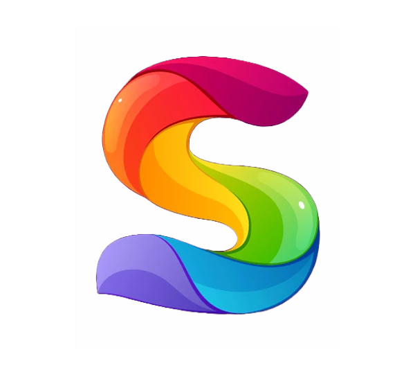

  
   

  <h3><b>Solomon Barine Akpuru</b></h3>

# 📗 Table of Contents

- [📖 About the Project](#about-project)
  - [🛠 Built With](#built-with)
    - [Tech Stack](#tech-stack)
    - [Key Features](#key-features)
  - [🚀 Live Demo](#live-demo)
- [👥 Authors](#authors)
- [🔭 Future Features](#future-features)
- [🤝 Contributing](#contributing)
- [⭐️ Show your support](#support)
- [🙏 Acknowledgements](#acknowledgements)
- [📝 License](#license)

# 📖 [Portfolio] 
 
This is my portfolio website.

## 🛠 Built With 
- React
- Three.js

  
FrameWork

  <ul>
    <li><a href="https://reactjs.org/">React.js</a></li>
  </ul>

  
3D Library

  <ul>
    <li><a href="https://threejs.org/">Three.js</a></li>
  </ul>

### Key Features 

- **Display of 3D models in a Browser**
- **Use of Framer Motion for smooth animations**

(<a href="#readme-top">back to top</a>)

## 🚀 Live Demo 

- [Live Demo Link](https://solly-portfolio.vercel.app)

## 👥 Authors 

👤 **Solomon Barine Akpuru**

- GitHub: [@githubhandle](https://github.com/solobarine)
- Twitter: [@twitterhandle](https://twitter.com/solomonAkpuru)
- LinkedIn: [LinkedIn](https://linkedin.com/in/solomon-akpuru)

(<a href="#readme-top">back to top</a>)

## 🤝 Contributing 

Contributions, issues, and feature requests are welcome!

Feel free to check the [issues page](../../issues/).

(<a href="#readme-top">back to top</a>)

<!-- SUPPORT -->

## ⭐️ Show your support 

If you like this project give a star.

(<a href="#readme-top">back to top</a>)

<!-- ACKNOWLEDGEMENTS -->

## 🙏 Acknowledgments 

I would like to thank everyone who contributed to the success of this project.

(<a href="#readme-top">back to top</a>)

## 📝 License 

This project is [MIT](./LICENSE) licensed.

_NOTE: we recommend using the [MIT license](https://choosealicense.com/licenses/mit/) - you can set it up quickly by [using templates available on GitHub](https://docs.github.com/en/communities/setting-up-your-project-for-healthy-contributions/adding-a-license-to-a-repository). You can also use [any other license](https://choosealicense.com/licenses/) if you wish._

(<a href="#readme-top">back to top</a>)

